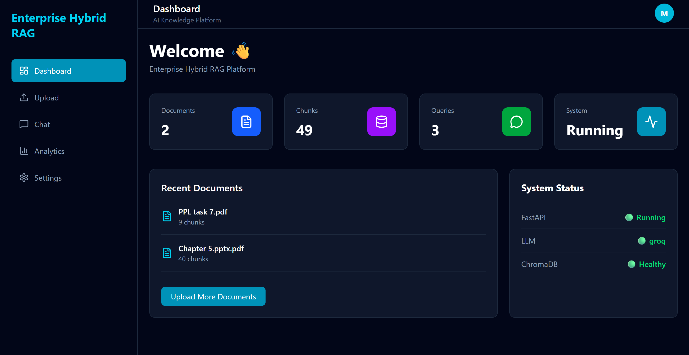
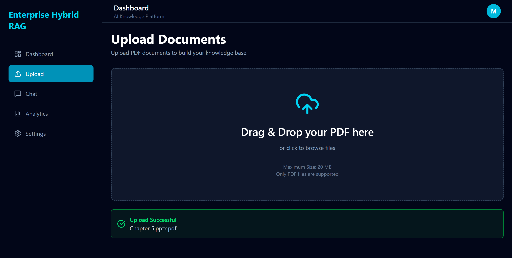
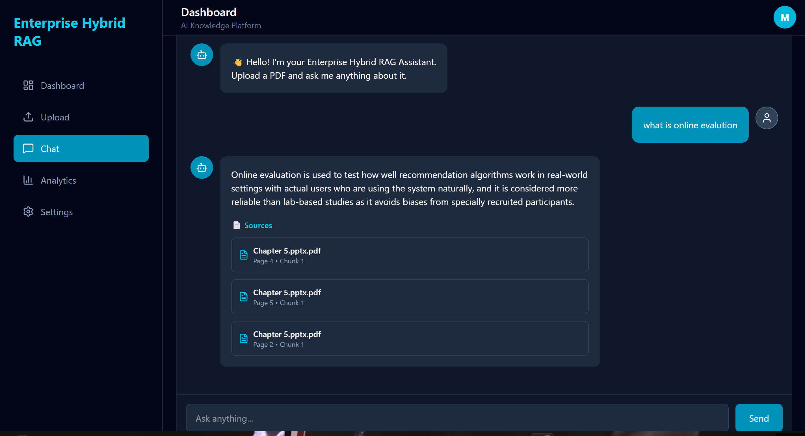
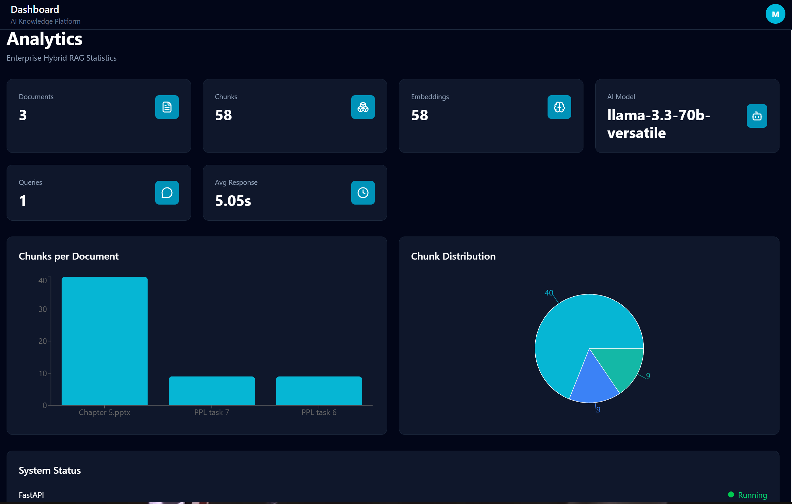
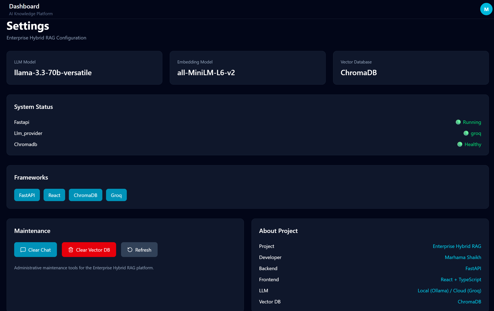

# 🚀 Enterprise Hybrid RAG Platform

An AI-powered Retrieval-Augmented Generation (RAG) platform that enables users to upload PDF documents and interact with them using natural language. The platform combines semantic search, keyword search, and reranking to provide accurate, context-aware answers.

---

## 🌐 Live Demo

**Frontend:** https://enterprise-hybrid-rag.vercel.app

**Backend API:** https://enterprise-hybrid-rag-production.up.railway.app

**Swagger API Docs:** https://enterprise-hybrid-rag-production.up.railway.app/docs

---

## ✨ Features

- 📄 Upload PDF documents
- 🧠 AI-powered question answering
- 🔍 Hybrid Retrieval (Semantic + BM25)
- 🎯 CrossEncoder reranking
- 🤖 Multi-provider LLM support
- ⚡ FastAPI backend
- ⚛️ React + Vite frontend
- ☁️ Railway deployment
- ▲ Vercel deployment
- 🐳 Docker support
- 📊 Analytics dashboard
- ⚙️ Settings management

---

## 🏗 Architecture

```text
                +----------------------+
                |     React (Vite)     |
                +----------+-----------+
                           |
                           |
                    REST API Calls
                           |
                           ▼
                +----------------------+
                |      FastAPI API     |
                +----------+-----------+
                           |
      +--------------------+---------------------+
      |                    |                     |
      ▼                    ▼                     ▼
 Upload Service      Chat Service        Analytics API
      |                    |
      ▼                    ▼
 PDF Parser        Hybrid Retrieval
                         |
         +---------------+---------------+
         |                               |
         ▼                               ▼
   Semantic Search                  BM25 Search
   (ChromaDB)                    (Keyword Search)
         |                               |
         +---------------+---------------+
                         |
                         ▼
               CrossEncoder Reranker
                         |
                         ▼
                   Prompt Builder
                         |
                         ▼
                 Groq / Ollama LLM
                         |
                         ▼
                     Final Answer
```

---

## 🛠 Tech Stack

### Frontend

- React
- TypeScript
- Vite
- Tailwind CSS
- Axios

### Backend

- FastAPI
- Python
- Uvicorn
- Pydantic

### AI

- Groq API
- Ollama
- Sentence Transformers
- CrossEncoder
- ChromaDB
- BM25

### Deployment

- Railway
- Vercel
- Docker
- GitHub

---

## 📂 Project Structure

```
enterprise-hybrid-rag/
│
├── frontend/
│
├── backend/
│   ├── app/
│   ├── uploads/
│   ├── processed/
│   ├── chroma_db/
│   └── requirements.txt
│
├── docker-compose.yml
└── README.md
```

---

## 🚀 Getting Started

### Clone Repository

```bash
git clone https://github.com/marhama13/enterprise-hybrid-rag.git
```

### Backend

```bash
cd backend

python -m venv venv

venv\Scripts\activate

pip install -r requirements.txt

uvicorn app.main:app --reload
```

### Frontend

```bash
cd frontend

npm install

npm run dev
```

---

## ⚙ Environment Variables

Backend

```env
GROQ_API_KEY=your_key
```

Frontend

```env
VITE_API_URL=https://your-backend-url
```

---

## 📸 Screenshots

## 📸 Screenshots

### Dashboard



### Upload



### Chat



### Analytics



### Settings



---

## 🚀 Future Improvements

- User Authentication
- Conversation History
- Multi-document Chat
- Citation Highlighting
- Streaming Responses
- Persistent Cloud Storage
- Vector Database Optimization

---

## 👨‍💻 Author

**Marhama Shaikh**

B.Tech Computer Science Engineering

GitHub:
https://github.com/marhama13

---

## ⭐ Support

If you found this project useful, consider giving it a ⭐ on GitHub.
